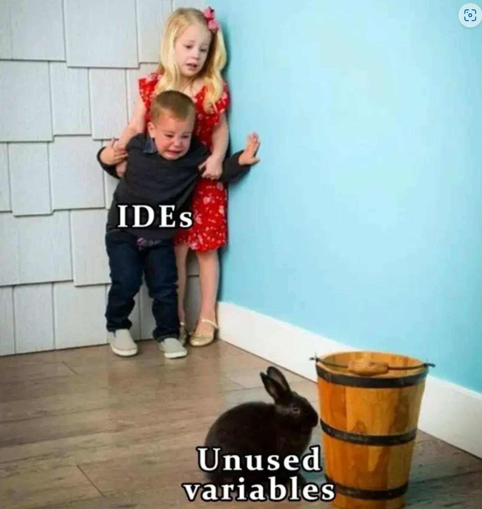
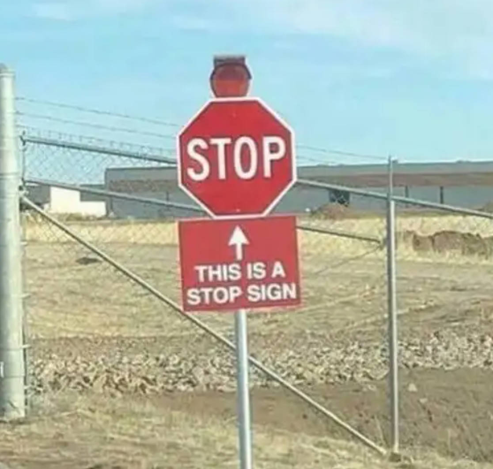
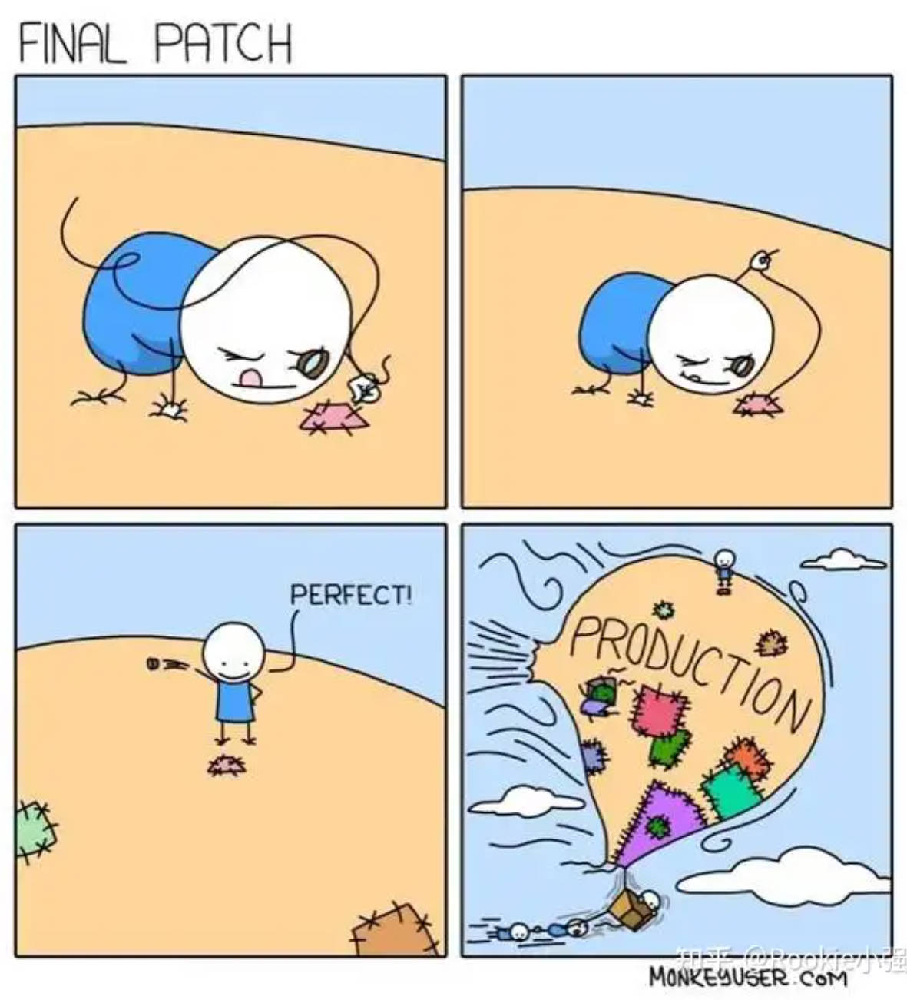
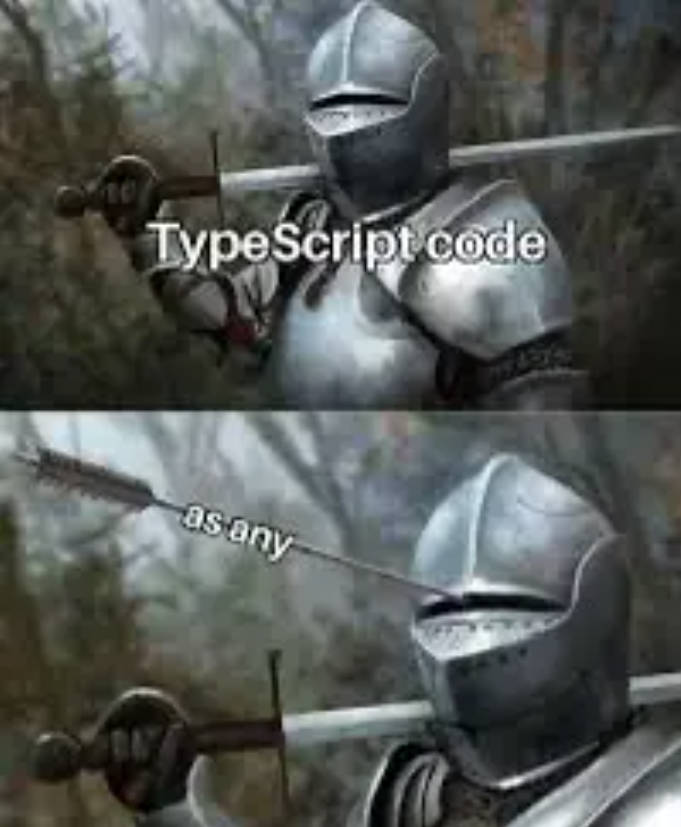
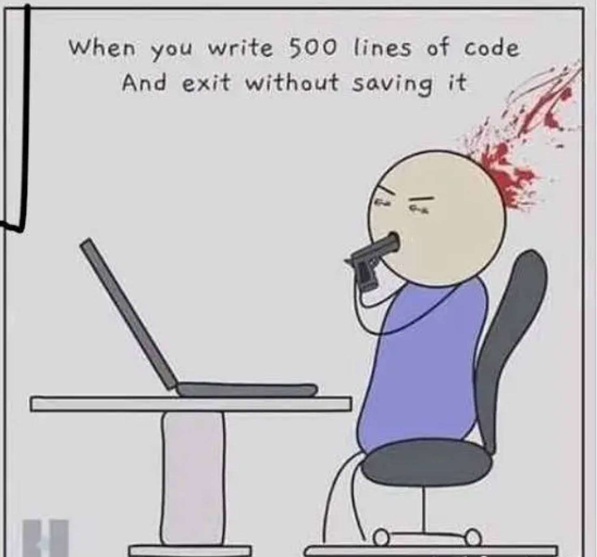
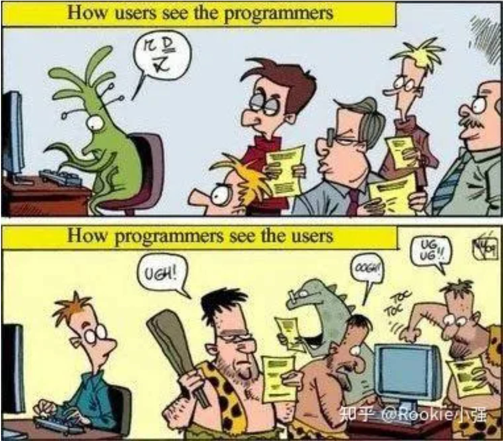

# 编程习惯

## 不好的习惯

旧代码没有及时删除

变量没有使用

写过于简单的注释，好的注释应该在意图层面编辑，以及特定说明。而不是把显而易见的内容重复了一遍或者将英文单词翻译成了中文。

过于关注某一个细节而忽略其他更大的问题

ts时出现各种any：

## 好习惯

开启自动保存

程序开发者和使用用户之间的思维差异可能会很大，互相看的时候可能是这样的：

所以在编程时要尽量多考虑到用户的不同情况。

